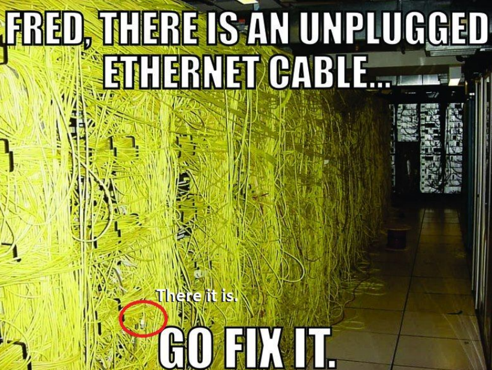

<h1 align=center>
  <strong> NetPractice </strong>
</h1>

---

## 💡 Overview :

---

> Since the project is a system administration-related one, I'll document pretty much everything you need to know about the project from start to finish in this readme file, hope you find this useful 😇

> And of course, I might and will be mistaken for something, so please if there's a mistake or a misunderstanding, let me know by doing a pull request or just by a direct message! THANK YOU SO MUCH! **THANK YOU SO MUCH** ☺️

---

## What is NetPractice?

---

NetPractice is an individual project at 1337 that requires us to  configure small-scale networks.
In a network, devices need to communicate. For this, [communication protocols](https://en.wikipedia.org/wiki/Communication_protocol) and models were created. Among them, there is the [TCP/IP model](https://www.geeksforgeeks.org/tcp-ip-model/). [TCP/IP](https://en.wikipedia.org/wiki/Internet_protocol_suite) is a set of [communication protocols](https://en.wikipedia.org/wiki/Communication_protocol). The name comes from two protocols TCP [(Transmission Control Protocol)](https://en.wikipedia.org/wiki/Transmission_Control_Protocol) and the IP [(Internet Protocol)](https://en.wikipedia.org/wiki/Internet_Protocol). It aims to standardize all network communications, particularly web communications. When configuring [TCP/IP](https://en.wikipedia.org/wiki/Internet_protocol_suite) settings on a device, a [subnet mask](https://en.wikipedia.org/wiki/Subnetwork) must be specified. This mask allows the device to determine which [IP addresses](https://en.wikipedia.org/wiki/IP_address) are on the [local network](https://en.wikipedia.org/wiki/Local_area_network) and which should be reached by a [gateway](https://whatismyipaddress.com/gateway) in the device's [routing table](https://en.wikipedia.org/wiki/Routing_table).

---

> I think we'll be OK now !!

---

> With big powers come big responsabilities.

---

### Project badge :

---

---

### Skills and requirements :

---

- Network & system administration
- Rigor

## Summary

  [∙ What is an IP?](#what-is-an-ip)
  
  [∙ What are the types of an IP address](#what-are-the-types-of-an-ip-address)
  
  [∙ What is the purpose of the IP addresses?](#what-is-the-purpose-of-the-ip-addresses)
  
  [∙ What is the difference between the IPv4 and the IPv6?](#what-is-the-difference-between-the-ipv4-and-the-ipv6)
  
  [∙ What is TCP/IP?](#what-is-tcpip)
  
  [∙ What is the difference between TCP and IP?](#what-is-the-difference-between-tcp-and-ip)
  
  [∙ How does TCP/IP exactly work?](#how-does-tcpip-exactly-work)
  
  [∙ What is a switch?](#what-is-a-switch)
  
  [∙ What is a router?](#what-is-a-router)
  
  [∙ How does a router work?](#how-does-a-router-work)
  
  [∙ What is the difference between a Modem and a Router?](#what-is-the-difference-between-a-modem-and-a-router)
  
  [∙ What is a loopback address?](#what-is-a-loopback-address)
  
  [∙ What is a subnet?](#what-is-a-subnet)
  
  [∙ How to calculate a subnet mask from IP address step by step?](#how-to-calculate-a-subnet-mask-from-ip-address-step-by-step)

---

## What is an IP?

---

### DEFINITIONS :

> An IP address stands for **Internet Protocol Address**, which is a set of rules for communication over the internet, such as sending emails, streaming videos, or connecting to a website, etc...

> An IP address is a string of numbers separated by periods. IP addresses are expressed as a set of four numbers — an example address might be 192.158.1.38. Each number in the set can range from 0 to 255. So, the full IP addressing range goes from 0.0.0.0 to 255.255.255.255.

  An IP address identifies a network or a device on the internet. And an IP address got two important parts, which are:
  * **The Network ID**
  * **The Host ID**

---

	<b><a href="#summary">⏫ Back To Top</a><b>

---

## What are the types of an IP address?

  There are two important types of an IP address, which are:
  1. **Static IP address:** which stay permanent and it doesn't change, and it's used mostly for important equipement, such as (businesses, servers...)
  2. **Dynamic IP address:** which changes occasionally, and it's used for consumer equipement, such as (laptop, smartphone, tablet...)

## What is the purpose of the IP addresses?

  * The purpose of the IP address is to **handle the connection** between devices that send and recieve data all across the network.
  * The IP address uniquely **identifies every device on the internet,** without one there's no other way to contact them.
  * IP addresses allow computing devices to **communicate with destinations** like websites and streaming services, and they let websites know who is connecting.

## What is the difference between the IPv4 and the IPv6?

  * **IPv4:** deployed in the 1981, works with a 32-bits address, and has over `4.3 billion addresses` (which is a small amount of addresses compared to IPv6), so IP addresses must be reused and masked, and it uses Numeric Dot-Decimal Notation `(ex: 192.108.42.64)`, and you have to configure it manually.
  * **Ipv6:** deployed in the 1998, works with a 128-bits address, and has over `340 undecillion addresses` (which is 340 trillion, trillion, trillion, trillion [36 zeros]), so every device can have it's unique IP address, and it uses Alphanumeric Hexadecimal Notation `(ex: 2002:0de6:0001:0042:0100:8c2e:0370:7234)`, and it supports auto-configuration.

## What is TCP/IP?

  TCP/IP stands for **Transmission Control Protocol/Internet Protocol**, which is a set of rules that guide and allow computers to communicate on a network such as the internet.

## What is the difference between TCP and IP?

  * TCP and IP are two separate computer network protocols.
  * IP is the part that **obtains the address** which the data is sent to, while TCP is the part that is responsible for **data delivery** once that IP address has been found.

## How does TCP/IP exactly work?

  TCP/IP job is to **divide the different communication tasks into layers**, each layer has a different function. Data goes through **four individual layers** before it is recieved on the other end, TCP/IP then goes through these layers in **reverse** to reassemble the data and represent it to the reciepent.
  * The four layers of the TCP/IP model are:

    * **Datalink Layer:** also called the physical layer, is what handles the physical parts of sending and recieving data using the Ethernet, or WiFi, etc...
    * **Internet Layer:** also called the network layer, and it controls the movement of the packets around the internet.
    * **Transport Layer:** is what provides a reliable data connection between two devices, it divides the data into packets, knows the packets that are recieved from the other device, and it makes sure that the other device knows the packets it recieves.
    * **Application Layer:** is the group of the applications that requires a network communication, which is what the user typically interacts with, such as emails, and messaging, because the lower layer handles the details of communication, and there's no need for the applications to concern themselves with it.

	<b><a href="#summary">⏫ Back To Top</a><b>

## What is a switch?

  A switch is a device that **connects devices within the same network**, usually a `LAN network (which is a Local Area Network)`, and forwards data packets to and from those devices, *unlike a router*, **a switch** *only sends the data to the devices it is intended for* (which may be another switch, a router, or a user's computer).

## What is a router?

  A router is a device that **connects two or more packet-switched networks or subnetworks**, it serves two primary functions, managing the traffic between these networks by forwarding data packets to their intended IP addresses, and allowing multiple devices to use the same internet connection.

## How does a router work?

  A router's job is to **direct and guide** the packets that are sent so they get to their destination (which is their IP address) as efficiently as possible, and in order to send the packets effictively, a router uses an `internal routing table (which is a list of paths to various network destination)`, a router read a packet header to determine where it is heading to, then it consults with the routing table to decide *which path is the most efficient* so the packet reaches its destination.

## What is the difference between a Modem and a Router?

  A router forms networks, and manages the flow of data within and between those networks, while a modem connects those networks to the internet. In another way, *a router only connects the devices with each other to make a LAN between them all, but with no access to the internet, on the other hand, a modem can connect to one device only, but provides access to the internet.*

  And in order to make a LAN that connects to the internet, you should **combine both a modem and a router together**, so that the router connects all the devices while a modem give them access to the internet.

## What is a loopback address?

  A **loopback address** is an address that is built into the IP domain system in order to allow for a device to **send and receive its own data packets.** And it is a distinct reserved IP address range that `starts from 127.0.0.0 and ends at 127.255.255.255`, and its used for various kind of analysis, usually for *testing purposes and debugging*.

---

	<b><a href="#summary">⏫ Back To Top</a><b>

---

## What is a subnet?

  A **subnet or a subnetwork** is a *network inside a network*. Subnets make networks more efficient.
  
  **Subnetting** is the process of stealing bits from the HOST part of IP address in order to divide the large network into smaller ones called subnets. After subnetting, we end up with **NETWORK SUBNET HOST** fields, and we always reserve an IP address to *identify the subnet* and another one to *identify the broadcast subnet address*, and through subnetting, network traffic can travel a shorter distance without passing through unnecessary routes to reach its destination.

## How to calculate a subnet mask from IP address step by step?

  We will work with the IP address `10.20.4.13/29`

  ### Step 1 : Find Subnet Number:
    Subtract prefix number from /32
    32 - 29 = 3
    
    Calculate Subnet Mask:
    8 bits - 3 bits = 5 bits (Network bits turned on)
    
    You might be asking why 8 bits, 8 bits are required for each octet.
    
    |-------|-------|-------|-------|-------|-------|-------|-------|
    | 128   | 64    | 32    | 16    | 8     | 4     | 2     | 1     |
    |-------|-------|-------|-------|-------|-------|-------|-------|
    | 1     | 1     | 1     | 1     | 1     | 0     | 0     | 0     |
    |-------|-------|-------|-------|-------|-------|-------|-------|
    | 128 + | 64 +  | 32 +  | 16 +  | 8     | =     248             |
    |-------|-------|-------|-------|-------|-------|-------|-------|
    
    Subnet Mask = 255.255.255.248
  
  ### Step 2 : Find Subnet Size:
    Raise 2 to the power of deducation (8 - 3 = 5) -> Let's called it n.
    
    2 ** n    = Subnet Size.
    2 ** 3    = Subnet Sizes for each subnet.
    2 * 2 * 2 = 8
    
    NOTE: 8 is the block size for the subnet, so for example:
    the increments will now be 0 8 16 32 40 and so on (we add 8 each time)
    
  ### Step 3 : Find Broadcast Address:
    Subnet size - 1
    (2 ** n) - 1  = Broadcast Address
    (2 ** 3) - 1  = (8 - 1) = 7
  
  ### Step 4 : Locate IP Address Subnet:
    Identify subnet block for IP address:
    -> Where in each increment is the address 10.20.4.13/29 located (0 8 16 32 40)?
    
    13 falls between 8 and 16 and therefore the address is in the valid host range of the subnet 10.20.4.8/29
  
  ### Step 5 : Calculate The Valid Hosts:
    Subnet size - 2
    (2 ** n) - 2 = Valid Host Range
    (2 ** 3) - 2 = (8 - 2) = 6
    
  ### And from these steps, we can know 4 important things:
    
    Subnet Address    -> 10.20.4.8/29
    Min Host Address  -> 10.20.4.9/29
    Max Host Address  -> 10.20.4.14/29
    Broadcast Address -> 10.20.4.15/29

---

## YouTube playlists to help you understand more about networking and related stuff :

  * https://www.youtube.com/watch?v=S7MNX_UD7vY&list=PLIhvC56v63IJVXv0GJcl9vO5Z6znCVb1P
  * https://www.youtube.com/watch?v=5WfiTHiU4x8&list=PLIhvC56v63IKrRHh3gvZZBAGvsvOhwrRF

---

	<b><a href="#summary">⏫ Back To Top</a><b>

---